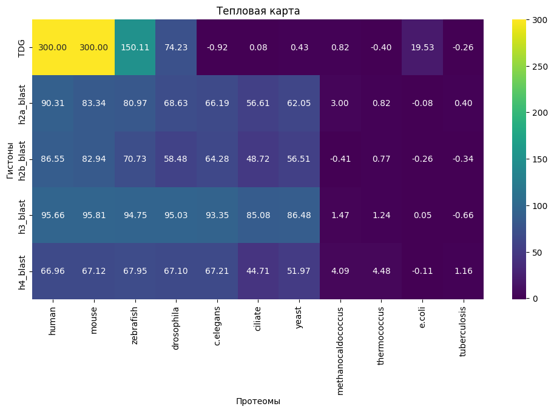

# Описание гена TDG**

**Описание:** Ген TDG кодирует фермент, который играет роль в одном из типов активного деметилирования ДНК. Этот ген отвечает за активное деметилирование 5-гидроксиметилцитозина (5hmC), что приводит к его превращению обратно в цитозин. Процесс активного деметилирования осуществляется с помощью фермента TDG на этапе эксцизионной репарации оснований (BER), который является частью системы восстановления поврежденной ДНК, но также деметилирования.

**Эпигенетическая функция:** TDG играет роль в распознавании и удалении модифицированных оснований 5-формилцитозина (5fC) и 5-карбоксицитозина (5caC) в процессе базового эксцизионного ремонта (BER). Это приводит к замене модифицированных оснований на немодифицированные основания, такие как цитозин (C). Таким образом, TDG играет важную роль в деметилировании ДНК.

**Ссылки на статьи:**
- [Статья 1](https://pubmed.ncbi.nlm.nih.gov/24153300/): В этой статье описывается функция гена TDG в активном деметилировании ДНК.
- [Статья 2](https://www.nature.com/articles/ncomms10806): В этой статье исследуется роль гена TDG в эксцизионной репарации оснований и распознавании модифицированных оснований.

**Ткани, в которых экспрессируется:** Ген TDG экспрессируется в различных тканях, включая лимфатический узел, аппендикс и еще 25 других тканей. Это указывает на широкое распространение и важность функции гена TDG в различных клеточных процессах.

**Комплексы:** TDG образует комплекс с ферментом APE1/TET1, который играет роль в базовом эксцизионном ремонте и модификации ДНК.

**Домены:** Ген TDG содержит домены, относящиеся к суперсемейству UDG-like, которые связаны с его функцией в распознавании и ремонте модифицированных оснований.

Все эти данные указывают на важную роль гена TDG в активном деметилировании ДНК.

# Описание процесса работы с геном TDG

Создаем файл drosophila.blast с последовательностью [отсюда](https://genome.ucsc.edu/cgi-bin/hgGene?hgsid=1642477790_R4rptSoOdAkvf2a3AR4gZJd1VK2j&hgg_do_getProteinSeq=1&hgg_gene=ENST00000266775.13).

Запускаем поиск BLASTp белка TDG против 11-ти протеомов.
Делаем это с помощью bash скрипта:

```
declare -a StringArray=("human" "mouse" "zebrafish" "drosophila" "c.elegans" "ciliate" "yeast" "methanocaldococcus" "thermococcus" "e.coli" "tuberculosis")

for i in ${StringArray[@]}; do
    echo $i
    blastp  -query tdg.fasta  -db /mnt/storage/project_2023/proteomes/$i.faa  -out $i.blast  -outfmt 7
done
```
Добавляем все полученные результаты в архив и скачиваем его с сервера:

```
zip -R first_blast '*.blast'
```
В другом терминале запускаем команду скачивания:
```
scp -i /Users/lizashcherbakova/.ssh/id_rsa -P 32222 eascherbakova_2@89.175.46.92:/home/eascherbakova_2/project/first_blast.zip /Users/lizashcherbakova/hse/bioinfa/project/blast1
```
# Множественное белковое выравнивание гистонов**

Варианты гистонов в целом очень похожи и имеют почти идентичные последовательности, поэтому можно считать их просто копиями друг друга и выбирать любые для дальнейших действий.

**Проделываем аналогичную c белком операцию для гистонов: H2A, H2B, H3, H4.**

Создаем новую папку для определенного гистона.
Записываем туда его fasta файл.
Копируем скрипт.
```
mkdir h2a
cd h2a
touch h2a.fasta
cp ../blast1.sh blast_h2a.sh
```
Меняем внутри него tdg.fasta на <название гистона>.fasta.

Запускаем скрипт.
Архивируем результаты.
```
bash blast_h2a.sh 
zip -R h2a_blast '*.blast'
```
Скачиваем на локальный компьютер.
```
scp -i /Users/lizashcherbakova/.ssh/id_rsa -P 32222 eascherbakova_2@89.175.46.92:/home/eascherbakova_2/project/h2a/h2a_blast.zip /Users/lizashcherbakova/hse/bioinfa/project/blast1
```
Получаем таблицы:

**E-Value**
|           |    human |    mouse |   zebrafish |   drosophila |   c.elegans |   ciliate |    yeast |   methanocaldococcus |   thermococcus |   e.coli |   tuberculosis |
|:----------|---------:|---------:|------------:|-------------:|------------:|----------:|---------:|---------------------:|---------------:|---------:|---------------:|
| TDG       | 0        | 0        |   7.85e-151 |     5.87e-75 |    8.3      |  0.83     | 0.37     |             0.15     |       2.5      | 2.98e-20 |          1.8   |
| h2a_blast | 4.94e-91 | 4.57e-84 |   1.06e-81  |     2.34e-69 |    6.53e-67 |  2.45e-57 | 8.88e-63 |             0.001    |       0.15     | 1.2      |          0.4   |
| h2b_blast | 2.85e-87 | 1.15e-83 |   1.85e-71  |     3.3e-59  |    5.28e-65 |  1.91e-49 | 3.07e-57 |             2.6      |       0.17     | 1.8      |          2.2   |
| h3_blast  | 2.19e-96 | 1.54e-96 |   1.77e-95  |     9.39e-96 |    4.46e-94 |  8.41e-86 | 3.31e-87 |             0.034    |       0.057    | 0.9      |          4.6   |
| h4_blast  | 1.09e-67 | 7.6e-68  |   1.13e-68  |     8.02e-68 |    6.15e-68 |  1.96e-45 | 1.08e-52 |             8.22e-05 |       3.31e-05 | 1.3      |          0.069 |

**-log(Evalue)**

|           |    human |    mouse |   zebrafish |   drosophila |   c.elegans |    ciliate |     yeast |   methanocaldococcus |   thermococcus |     e.coli |   tuberculosis |
|:----------|---------:|---------:|------------:|-------------:|------------:|-----------:|----------:|---------------------:|---------------:|-----------:|---------------:|
| TDG       | 300      | 300      |    150.105  |      74.2314 |   -0.919078 |  0.0809219 |  0.431798 |             0.823909 |      -0.39794  | 19.5258    |      -0.255273 |
| h2a_blast |  90.3063 |  83.3401 |     80.9747 |      68.6308 |   66.1851   | 56.6108    | 62.0516   |             3        |       0.823909 | -0.0791812 |       0.39794  |
| h2b_blast |  86.5452 |  82.9393 |     70.7328 |      58.4815 |   64.2774   | 48.719     | 56.5129   |            -0.414973 |       0.769551 | -0.255273  |      -0.342423 |
| h3_blast  |  95.6596 |  95.8125 |     94.752  |      95.0273 |   93.3507   | 85.0752    | 86.4802   |             1.46852  |       1.24413  |  0.0457575 |      -0.662758 |
| h4_blast  |  66.9626 |  67.1192 |     67.9469 |      67.0958 |   67.2111   | 44.7077    | 51.9666   |             4.08513  |       4.48017  | -0.113943  |       1.16115  |

**На основе последней таблицы получаем тепловую карту**

Код, использованный для построение таблиц и карты приведен в [коллабе](https://colab.research.google.com/drive/1mO3n4eBgCozRHvXl1Y0eCVRRTz88oDo9?usp=sharing).
